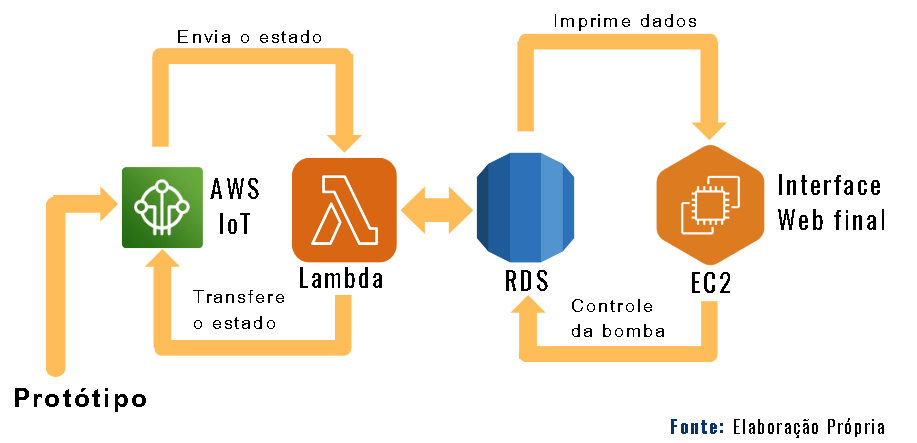

 

 
<h1>Monitoramento de Ativos e Servidor da Cidade</h1>

<h2>Sobre o Repositório:</h2>
<a>Repositório com documentação para permitir manter o código-fonte dos projetos em ordem.</a>
 
 
<strong>Colaboradores:</strong> 
<a>João Emanuel de Souza</a> 
<a>Caio Alves de Souza</a>  

 
<h2>Monitoramento de Ativos e Servidor da Cidade</h2>

 

